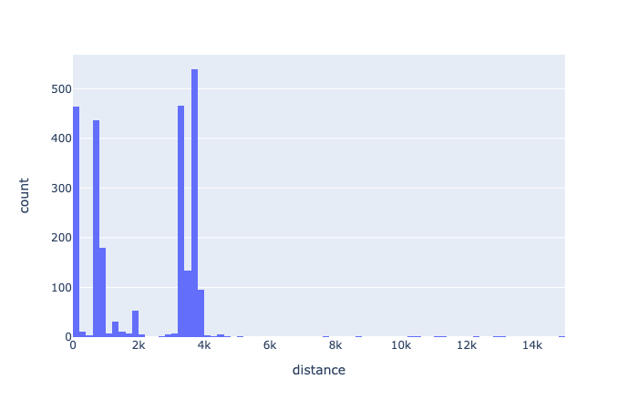
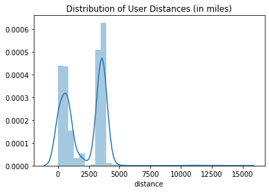
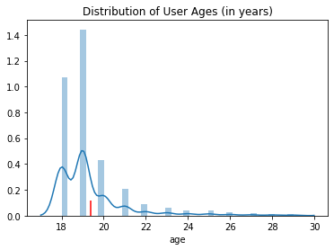
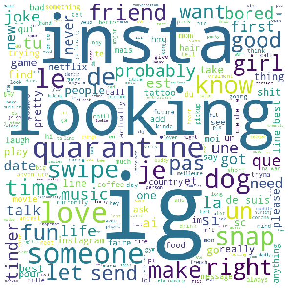
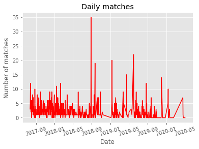
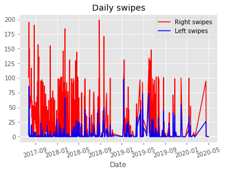
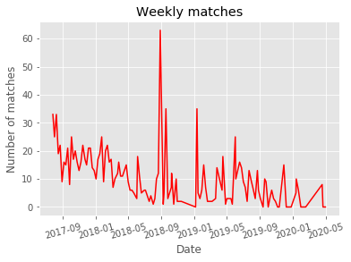
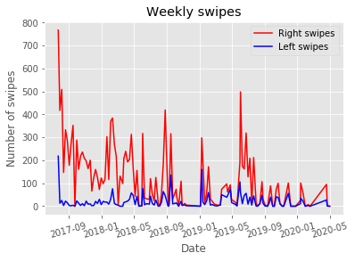
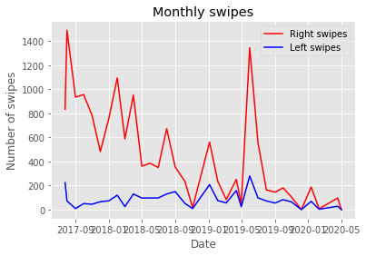

# Tinder 🤖

On April 2nd, 2020 (day after April Fool's Day lol), Tinder announced that it will open up the use of its Passport feature to all Tinder users. The Passport feature allows you to match with people all over the world versus your nearby area in an attempt to combat loneliness and boredom during the shelter in place and quarantine directives being rolled out all over.

The purpose of this project is two-fold:
1. Can we harness the power of online dating to land me a job?
2. Can I find a statistically significant insight on Tinder users based on an activity

## Chapter 1 - Set Up
I decided to use this opportunity to gather Tinder profile to build a database to apply my newfound data science and analytical skills towards in an attempt to combat my loneliness and boredom during quarantine.

I wanted to take this project one step further and web-scrape the profile information of all the users it came across.

The bot is Python-based and utilizes Selenium to run a WebDriver to simulate a user's session.  Luckily in addition to the popular mobile app, Tinder offers the same service on a computer internet browser.

###### GIF LOGIN

I set my bot to the "equal opportunity" setting which swipes left (in the rejection direction for the uninitiated) for everyone. If I want to use Tinder for it's intended purposes, I would ideally like to train it with my personal preferences via a neural network.  But that sounds like a lot of labelled data and will be slated for the future.

###### GIF LEFT SWIPE

I've also created a quick program that rates people's attractiveness using haystack.ai, but, decided not to use.

##### GIF OF HTML SITE IN USE

All data per web-scraping session is constantly saved and appended to a local csv file that is later aggregated into a master file.

## Chapter 2 - Initial Findings
* 2497 TOTAL ENTRIES GATHERED
* 2493 ENTRIES HAVE AGE DATA (99.8%)
* 1123 ENTRIES HAVE COLLEGE DATA (45.0%)
* 311 ENTRIES HAVE JOB DATA (12.5%)
* 623 ENTRIES HAVE CITY DATA (24.9%)
* 391 ENTRIES HAVE GENDER DATA (15.7%)
* 2487 ENTRIES HAVE DISTANCE DATA (99.6%)
* 1733 ENTRIES HAVE DETAILS DATA (69.4%)
* AVERAGE AGE IN DATA SET: 19
* NUMBER OF UNIQUE COLLEGES: 337
* NUMBER OF UNIQUE JOBS: 265
* NUMBER OF UNIQUE CITIES: 163

Majority of the data came from nearby local users in Vancouver

Below is the distribution of ages of the profiles in the dataset with a vertical line drawn at the mean age (19)

Below is a word cloud of the details section (bio section) across the entire dataset.

Huh, a LOT of Instagram mentions on Tinder. Who woulda thunk. I wonder if users are using their profiles in an attempt to grow their IG following to become a more influential influencer. Sounds like another project for another time.

In the meantime, I hand picked certain topics I was interested in and checked for keywords relating to that topic. This list can be easily appended and expanded with future topics or keywords.

Topics Include:

* Instagram / Snapchat Mentions
* COVID-19 / Quarantine Mentions
* Weed / Cannabis Mentions
* Alcohol Mentions
* Netflix / TV / Movies Mentions
* Hobby / Activity Mentions

Out of 2497 entries:
* 397 ENTRIES MENTIONED INSTAGRAM (15.8%)
* 98 ENTRIES MENTIONED SNAPCHAT (3.9%)
* 104 ENTRIES MENTIONED COVID19 (4.1%)
* 20 ENTRIES MENTIONED CANNABIS (0.8%)
* 64 ENTRIES MENTIONED ALCOHOL (2.5%)
* 54 ENTRIES MENTIONED TV (2.2%)
* 68 ENTRIES MENTIONED HOBBIES (2.7%)

## Chapter 3 - Self Exploration

Right, I’ve got my data and my friends, but now what? Time to clean the data.

Now that the data was in a nice format, I managed to produce a few high level summary statistics. The dataset contained:

* 1 girl
* 2 guys
* #of one message conversations
* #of unique conversations
* #of matches
* #of messages sent
* #of app opens
* #of right swipes
* #of left swipes

## Chapter 4 - Conclusion

Ideas For Future Work:
* idea 1
* idea 2
* idea 3
